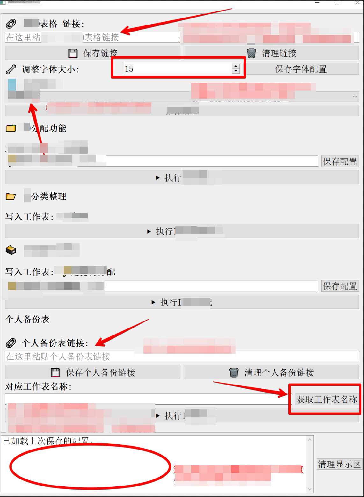

# Ticket Data Matching System with Incremental Processing

> A multi-component data processing system for managing, classifying,
> and incrementally matching ID records across collaborative workflows
> involving 90+ contributors.

---

## Project Overview

In team-based data workflows with a large number of contributors,
the same records are evaluated repeatedly by different team members, leading to:

- duplicated classification work across contributors
- inconsistent results when processing the same records multiple times
- increasing manual effort as data volume grows
- no reuse of previously validated results

This project introduces a structured system that separates data collection,
classification, matching, and storage into independent components,
enabling incremental processing and reuse of historical data.

The system was designed to support workflows involving 90+ contributors,
where data volume and concurrent evaluation work make manual processing
and single-sheet solutions impractical.

---

## System Components

The system consists of two main parts:

### Part 1 — Team Evaluation and Data Collection (Google Apps Script)

Manages the collaborative evaluation workflow across multiple contributors.

Key functions:
- custom menu interface for triggering all workflow steps
- color-coded classification of records across multiple sheets
  into predefined categories based on evaluation results
- automated consolidation of category changes across all contributors
- automated daily backup combining results from all contributors
- batch processing with timeout handling and trigger-based continuation
  for large datasets (10MB file size management)
- writing classified results into structured JSON files on Google Drive
- date-based data cleanup to remove outdated records

### Part 2 — Record Matching and Distribution (Google Apps Script + Python)

Handles matching of new records against the historical JSON dataset
and distributes results to classification sheets.

Key functions:
- loading multiple JSON classification files from Google Drive
  representing different evaluation categories
- matching incoming records against predefined classification categories
- writing matched results to corresponding sheets
- distributing unmatched records in configurable batches for manual review
- cross-spreadsheet data backup and archiving
- time tracking and daily work log registration

The core matching logic is implemented in Python for more flexible
processing beyond Google Apps Script execution limits.

### Desktop Application (PyQt5)

To reduce operational errors and simplify the workflow for contributors,
a desktop application was developed with a graphical interface.

Key features:
- configurable batch size for record distribution
- individual contributor backup sheet management with link verification
- language support for multilingual teams
- real-time progress display during processing
- saved configuration across sessions


*Interface shown with internal labels redacted. Operational language: Chinese.*

---

## Architecture

```text
Contributor Sheets (Evaluation Input)
        │
        ▼
Google Apps Script (Collection + Classification)
        │
        ▼
JSON Files on Google Drive (Historical Dataset)
        │
        ▼
Python Matching Layer (Core Logic)
        │
        ▼
Google Sheets (Classified Output + Distribution)
```

---

## Workflow

```text
Contributors evaluate records in individual sheets
        ↓
Daily backup collects and consolidates results
        ↓
Classified records written to JSON dataset on Google Drive
        ↓
New records matched against historical JSON dataset
        ↓
Matched records distributed to classification sheets
        ↓
Unmatched records distributed for manual review
        ↓
Historical dataset updated for future runs
```

---

## Design Decisions

**JSON as historical storage**
Lightweight, portable, and readable without infrastructure.
Suitable for team workflows without a dedicated backend.

**Separation of collection and matching**
Team evaluation (GAS) and matching logic (Python) are independent.
This allows the matching layer to be replaced or extended
without affecting the collection workflow.

**Incremental processing**
Only unmatched records are processed in each run.
Previously validated results are reused directly from the historical dataset.

**Batch processing with timeout handling**
Google Apps Script has a 6-minute execution limit.
The system uses progress tracking and time-based triggers
to continue processing large datasets across multiple runs.

**Transition from Google Apps Script to Python**
With 90+ contributors generating data across multiple sheets,
JSON files began approaching the 10MB threshold,
making it difficult for GAS triggers to complete a full scan
within the 6-minute execution limit.

The Python layer was introduced to handle matching logic
independently of these constraints.

For future scaling, a database layer could replace the current
JSON storage, removing the file size limitation entirely.
The exact implementation is still in the planning stage.

**Error reduction through interface design**
As contributor count grew, operational errors from manual steps
increased. A desktop application with a guided interface was
introduced to standardize the workflow and reduce input errors,
alongside contributor training documentation.

---

## Technologies

| Technology | Role |
|---|---|
| Google Apps Script | Team workflow automation, data collection, UI |
| Python | Core matching logic, incremental processing |
| PyQt5 | Desktop application interface for contributors |
| JSON | Historical dataset storage, intermediate data layer |
| Google Sheets | Data input, output, and team interaction |
| Google Drive | Centralized JSON file storage |

---

## Implementation Notes

The Google Apps Script components handle team collaboration workflows
and contain internal operational data.
These components are not published in this repository.

The `src/data_matching/` folder contains a Python demo of the core
matching logic, using local JSON files as sample data.

---

## Project Evolution

- Initial stage: simple automation of manual data filtering
- Intermediate stage: structured data processing with rule-based logic
- Current stage: multi-component system with incremental matching,
  collaborative evaluation workflow, and desktop application interface

---

## Related Projects

- [Multi-Source Data Processing Automation](https://github.com/elinw26/multi-source-data-processing)  
  Introduces structured JSON storage and modular processing
  across multiple data sources

- [Basic Data Processing Automation](https://github.com/elinw26/basic-data-processing-automation)  
  Initial automation of manual spreadsheet workflows
  using Google Apps Script
