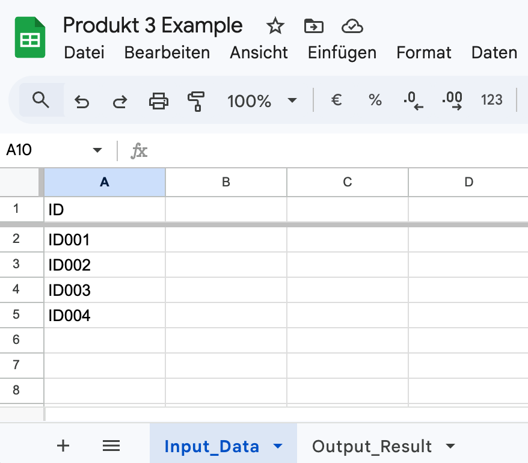
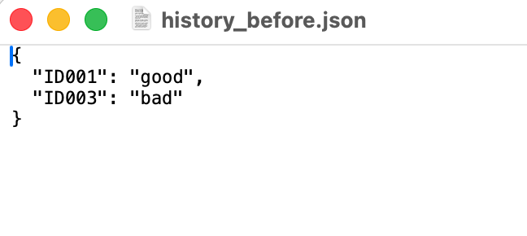
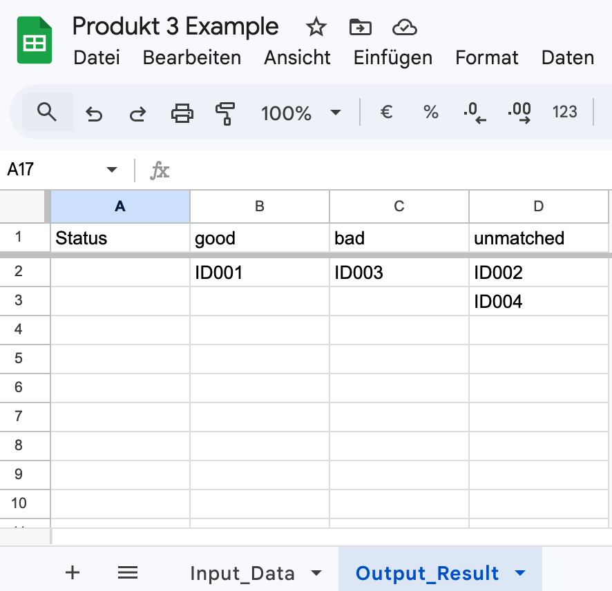
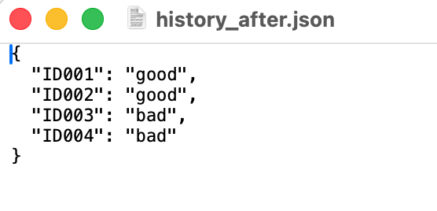

# Ticket Data Matching System with Incremental Processing

> Automates the processing of repeated ticket data by reusing historical results and reducing manual classification work.

---

## Project Overview

In multi-source support workflows, similar or identical records are processed repeatedly.

This leads to:

- duplicated manual work
- inconsistent classification results
- increasing effort as data volume grows

This project introduces a reusable data matching system that separates processing logic from data storage and enables scalable, incremental data processing.

---

## Problem

Data collected from multiple sources requires repeated manual checking and classification.

Existing workflows rely on:

- manual filtering
- repeated validation of known records
- reprocessing of already handled data

This results in inefficiency and inconsistency across teams.

---

## Design

The system is designed around three key decisions:

- **Reusable historical dataset (JSON)**  
  Stores previously processed results to avoid reprocessing identical records

- **Separation of concerns**  
  Distinguishes between data input (Google Sheets), processing (Python), and storage (JSON)

- **Incremental processing approach**  
  Only new or unmatched records are processed in each run

---

## Impact

- reduces repeated manual classification effort
- ensures consistent results across repeated processing runs
- enables scalable processing as data volume increases
- supports reuse of validated historical data

---

## Example (Before → After)

### Before

<table>
  <tr>
    <td valign="top">
      
    </td>
    <td valign="top">
      
    </td>
  </tr>
</table>

### After

<table>
  <tr>
    <td valign="top">
      
    </td>
    <td valign="top">
      
    </td>
  </tr>
</table>

---

## Workflow (Core Logic)

```text
New Data
   ↓
Check Against Historical Dataset
   ↓
Reuse Known Results
   ↓
Process Only New / Unmatched Records
   ↓
Update Dataset for Future Runs
```

---

## Input / Output

### Input

- raw records from Google Sheets  
- existing historical dataset (JSON)  

### Output

- structured and classified results in spreadsheet  
- updated historical dataset for reuse  

Results are grouped by classification categories to improve readability and highlight processing outcomes.

---

## Project Structure

### Modules

- **data_preparation**  
  transforms raw spreadsheet data into structured datasets  

- **data_matching**  
  compares incoming data with historical records and identifies matches  

- **integration**  
  connects Google Sheets with processing logic and manages data flow  

```text
src/
    data_preparation/
    data_matching/
    integration/

docs/
    architecture.md
    workflow.md
    code-structure.md
```

---

## Technical Focus

This project focuses on:

- structuring data processing workflows  
- separating data input, processing, and storage  
- improving maintainability through modular design  
- reducing repeated work through incremental processing  
- applying automation to support operational workflows  

---

## Project Evolution

This project is part of an iterative development process:

- Initial stage: simple automation of manual data filtering  
- Intermediate stage: structured data processing with rule-based logic  
- Current stage: reusable data matching system with modular architecture  

---

## Technologies

- Python  
- JSON  
- Google Sheets  
- Google Drive  
- Google Apps Script  

---

## Notes

- designed as a lightweight automation solution for small-scale workflows  
- suitable for environments without dedicated backend infrastructure  
- can be extended to database-based systems for larger-scale applications  

---

---

## Related Projects

This project is part of an iterative development process:

- [Multi-Source Data Processing Automation](https://github.com/elinw26/multi-source-data-processing)  
  Introduces structured intermediate datasets and modular processing for multi-source spreadsheet workflows  

- [Basic Data Processing Automation](https://github.com/elinw26/basic-data-processing-automation)  
  Initial automation of manual spreadsheet processing, focusing on filtering, transformation, and data structuring  

This progression reflects the transition from simple automation scripts to a reusable data matching system with incremental processing.
